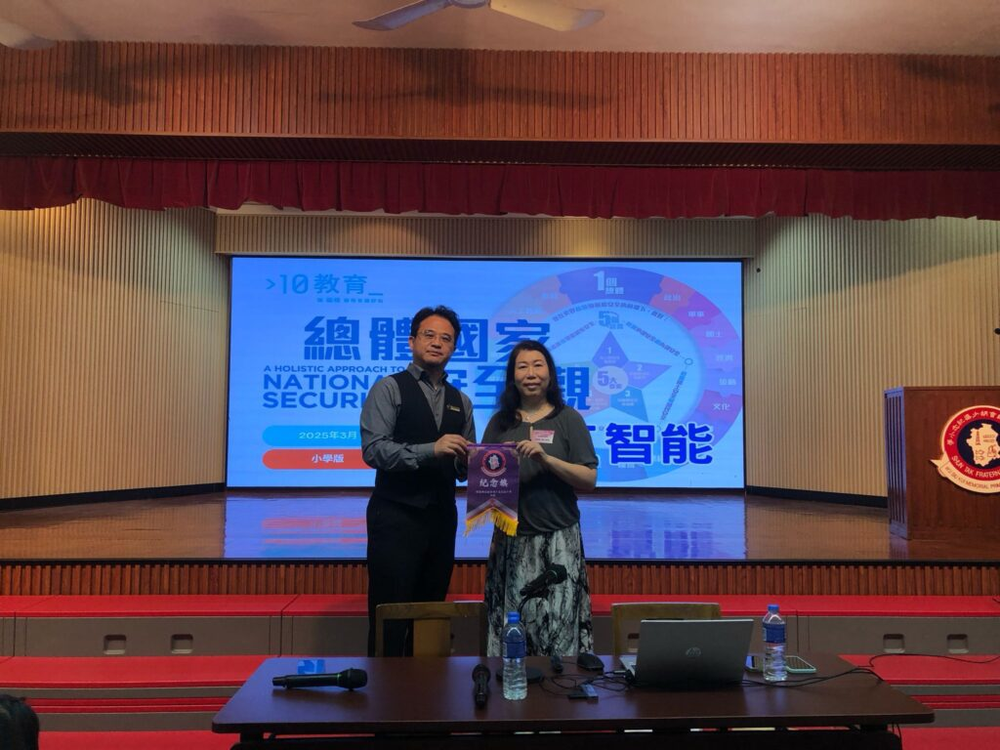

## [10教育](/)在[順德聯誼總會胡少渠紀念小學](https://www.wusiukui.edu.hk/)成功舉辦國家安全與人工智能講座

**[順德聯誼總會胡少渠紀念小學](https://www.wusiukui.edu.hk/)高校長代表學校頒發感謝狀，感謝10教育對人工智能與國家安全教育講座的貢獻。**

2025年3月28日，10教育的講師Jenny Li在[順德聯誼總會胡少渠紀念小學](https://www.wusiukui.edu.hk/)舉辦了兩場國家安全為主題的講座，與學生們一起探索人工智能及國家安全的重要性。此次活動以趣味性和互動性為核心，為小學生們帶來了一場別開生面的學習體驗。

深入淺出：讓孩子了解人工智能與國家安全

活動中，講者 Jenny Li 運用貼近日常生活的例子，成功將複雜的概念轉化為孩子們能理解的知識點。通過生動的比喻和精彩的故事，她引導學生認識人工智能的基本原理以及國家安全對社會的重要性。

問答互動：激發孩子的好奇心

活潑的問答環節是本次講座的亮點之一。Jenny 引導學生進行思考，並鼓勵他們提出關於科技和安全的問題。在輕鬆的氛圍中，學生們既獲得知識，也提升了對科技的興趣。

教育使命：為未來播下知識的種子

10教育致力於通過創新的教育方式啟發學生的潛能。本次講座再次證明了，年幼的孩子也能掌握人工智能及國家安全的基礎知識，並對其產生濃厚的興趣。

10教育將持續推動 AI 在教育領域的應用，並計劃在未來舉辦更多針對不同需求的 AI 進階培訓。如果您的學校對 AI 教育應用有興趣，歡迎與我們聯繫，共同探索 AI 如何改變未來的教與學！
