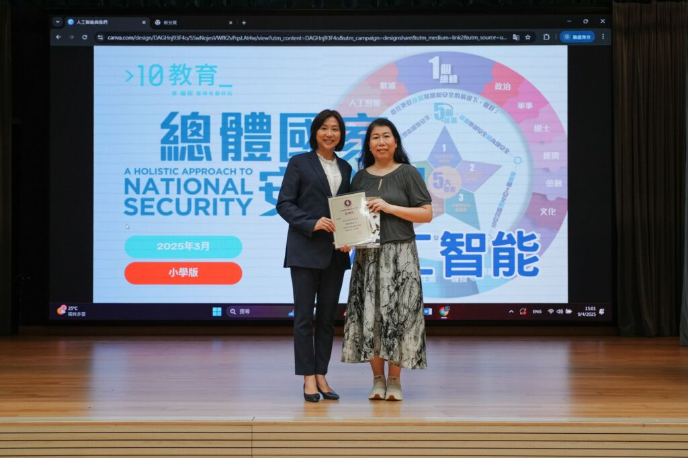

## 國家安全與你我息息相關

**10教育 講者 Jenny Li 與順德聯誼總會李金小學林校長合照**

## 讓國家安全從小萌芽：順德聯誼總會李金小學活動回顧

我們 10教育 很榮幸受邀來到順德聯誼總會李金小學，為小學生們帶來了一場充滿趣味與互動的國家安全講座。此次講座特別針對小學生的學習需求，講者 Jenny Li 以深入淺出的方式，通過生動的比喻與貼近日常生活的小故事，成功讓孩子們了解了「人工智能」和「國家安全」的基本概念。

講座亮點在於強調互動性與趣味性，透過活潑的問答環節和引人入勝的內容，激發學生對科技的好奇心，並幫助他們建立對國家安全的初步認識。值得一提的是，Jenny Li 運用孩子能理解的方式，輕鬆地將抽象的概念轉化為具象的情境，使學生們更加深刻地認識到人工智能的重要性及其與國家安全的關聯性。

我們深知，向年紀較小的孩子講解這些複雜概念並不容易，但這次的成功經驗告訴我們，只要方法得當，國家安全和人工智能的理念也能引起孩子們的濃厚興趣。非常感謝順德聯誼總會李金小學的支持以及所有參與的學生們的熱烈回應！

如果您對舉辦類似主題的講座感興趣，或想了解更多 10教育 如何以創新方式向學生普及科技知識，歡迎與我們聯繫，共同探索 AI 如何改變未來的教與學！