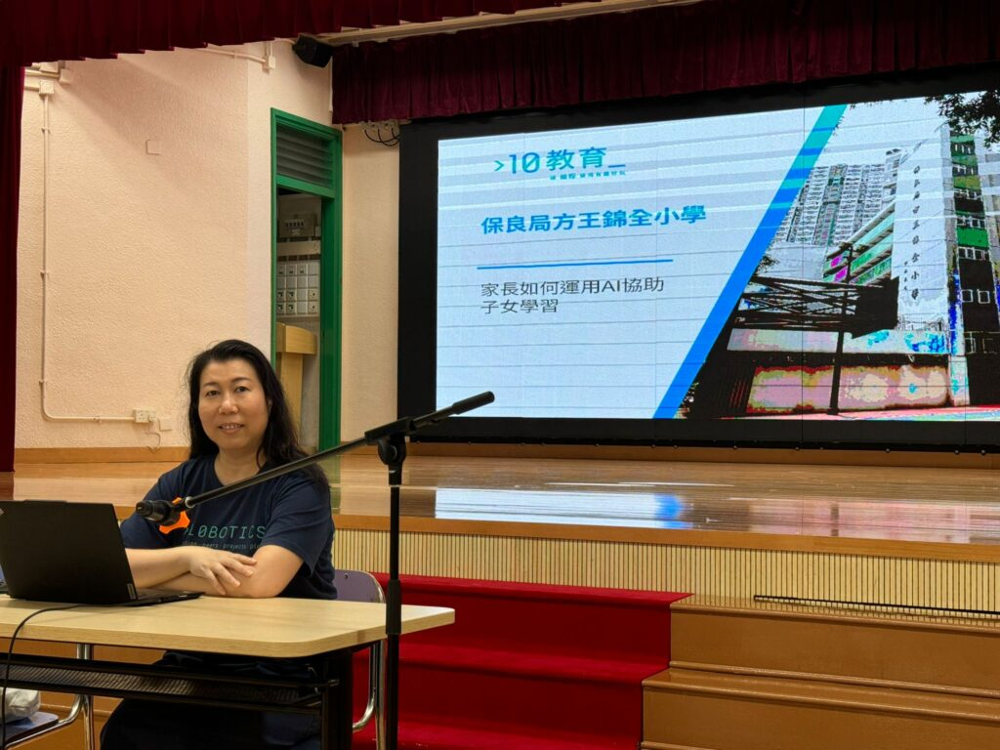

## 「家長STEAM教育講座」圓滿落幕！

**10教育 講者 Jenny Li在保良局方王錦全小學講解AI教育及Prompt Engineering技巧**

我們很高興分享，保良局方王錦全小學於5月22日及29日舉辦的「家長STEAM教育講座」圓滿落幕！兩場講座聚焦 AI教育 與 Prompt Engineering，吸引眾多家長熱烈參與，反饋極佳！

### 📢 家長最關注的AI教育議題

講座中，我們深入探討：✅ 家長如何運用AI協助子女學習✅ 認識人工智能（AI）的發展與教育應用✅ AI的風險與挑戰，以及家長引導策略✅ 實用AI工具推薦（如Deepseek、Perplexity等）✅ Prompt Engineering技巧：COSTAR框架解析、常見錯誤與優化

### 🌟 家長迴響熱烈

問卷調查顯示：

- 超過95%家長對內容表示「非常滿意」
- 高度讚賞講者的專業互動與實用案例分享
- 家長最感興趣主題：AI工具實際操作 與 安全引導孩子使用AI

### 🎤 讓專業講者為您的學校帶來精彩分享！

這次講座的成功，證明了STEAM與AI教育對現代家長的重要性。若貴校也想為家長和學生提供 前沿的AI學習策略 或 實用的Prompt Engineering工作坊，歡迎與我們聯繫，共同探索 AI 如何改變未來的教與學！