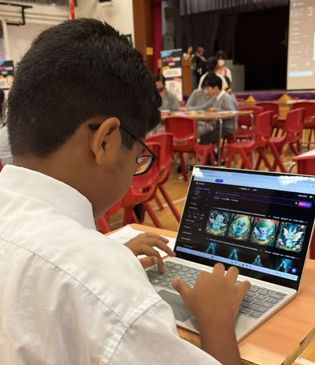

「只用一句話，AI就能畫出你的想像！」

在可立中學 STEM Day，學生們體驗的不只是 AI 繪圖工具，而是未來最重要的能力：如何與AI對話，讓它理解你的想法，將腦海中的意念變成看得見的成果。10教育很榮幸能夠參與這次創新的教育活動，為學生們帶來前沿的AI藝術創作體驗。

## 活動重點 🌟

在這次 STEM Day 活動中，學生們親身體驗了AI藝術創作的奇妙世界：

💡 **提示工程（Prompt Engineering）教學**
- 學習如何設計精準的AI指令
- 掌握與AI溝通的技巧和方法
- 理解指令細節對創作結果的重要影響

🎨 **AI藝術創作實作**
- 使用最新的AI繪圖工具
- 將創意想法轉化為視覺作品
- 體驗「一句話改變世界」的創作力量

✨ **核心學習成果**：
- 🌟 AI 不是取代人類，而是放大我們的創造力
- 🌟 關鍵不在工具，而在如何設計出好指令
- 🌟 精準的提示 ➔ 理想的結果
- 🌟 好的指令 ➔ AI成為最懂你的夥伴

## 教育意義 📚

這次活動讓學生們深刻體會到：

🎯 **「原來，只要講得清楚，AI就能畫得出來！」**

通過實際操作，學生們明白了：
- **溝通能力的重要性**：清晰表達想法是與AI協作的關鍵
- **創意思維的培養**：AI工具能幫助學生實現更大膽的創意構想
- **未來技能的準備**：提示工程將成為未來職場的重要技能

## 學習成果與反思 💭

參與的學生紛紛表示，這次體驗讓他們對AI有了全新的認識：

✅ **技術層面**：
- 掌握了基本的AI繪圖工具操作
- 學會了編寫有效的提示指令
- 理解了AI創作的原理和限制

✅ **思維層面**：
- 培養了與AI協作的新思維模式
- 提升了創意表達和溝通能力
- 建立了對未來科技發展的正確認知

## 未來展望 🚀

未來，懂得如何與AI溝通的人，將掌握AI的力量。10教育致力於為學生們提供最前沿的AI教育體驗，培養他們成為新世代的創新領袖。

我們相信，通過這樣的實踐活動，學生們不僅學會了使用AI工具，更重要的是培養了面向未來的思維方式和解決問題的能力。

---

✉️ **想讓你的學生體驗「一句話改變世界」的力量？**

立即聯絡我們，攜手推動 AI 教育，培養新世代的創新領袖。10教育將為您的學校量身定制AI教育方案，讓學生在實踐中掌握未來最重要的技能。
