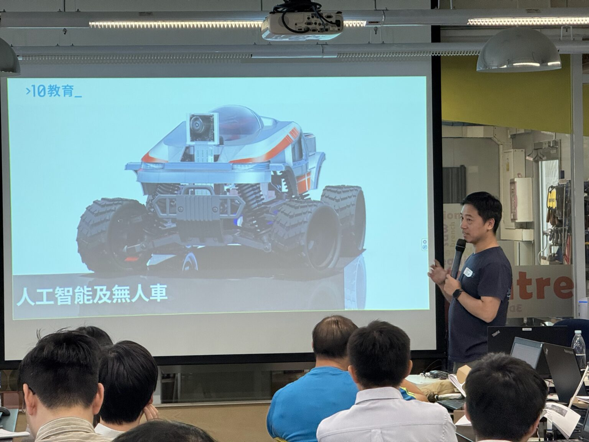

# 香港中學教師AI培訓實錄｜Donkey Car無人車工作坊｜Raspberry Pi×Python實作指南

**《 Donkey Car 動手實作，引領中學STEAM教學新浪潮！》——教師工作坊回顧**
專為香港中學教師量身打造的「STEAM教育知識增益系列：在中學 STEAM教育中使用單板電腦作為教學工具應用人工智能技術設計與製作自動駕駛模型車（新辦）」實戰工作坊圓滿落幕！本次活動由教育局統籌，10教育創辦人Jonathan提供工作坊，讓本地中學老師深度探索 Raspberry Pi，結合 Python編程 與 Donkey Car開源平台的教學應用。

## 🔍 三大核心環節實戰紀錄

1.Raspberry Pi實戰教師親手操作：

* 解析中央處理器（CPU） 運作邏輯
* 連接顯示屏（輸出設備） 與環境設定
* 執行簡單指令及Python基礎編程輸出結果

2.AI視覺技術

* 拆解Donkey Car如何透過鏡頭'看見'環境
* 實例演示機器學習影像分析決策流程

3\. Donkey Car實作
教師分組完成：
✅ 數據收集 → AI模型訓練 → 自動避障導航
✅ Raspberry Pi即時處理影像數據
✅ Python程式控制方向與速度
💡 想了解更多關於Donkey Car？[立即點擊進入YouTube[教學播放清單](https://youtu.be/4glPTHVXWiE?feature=shared)]

## 🚀 未來教學延伸應用

工作坊緊扣香港教育趨勢，賦能教師將無人駕駛技術轉化為課堂教案：
教師可引導學生：

1. 跨學科整合：資訊科技（Python編程） × 人工智能
2. 實作專題：停止牌辨識
3. 職涯啟發：對接香港智慧城市發展的AI工程人才需求

## ✨ 專業教育夥伴邀請

自2023年人工智能教育爆發元年（ChatGPT面世）起，我們深耕教師AI培訓，將生成式AI轉化為落地教學方案，具備豐富經驗：

* 近3年為200+中小學提供各類AI及STEAM課程
* 為香港頂尖[大學](https://youtu.be/1FxmMF0kFok?feature=shared)、法定公營機構及[科學館](https://youtu.be/vnHyImdwN_E?feature=shared)提供AI工作坊
* 通過實戰 AI 工作坊，賦能教育者掌握生成式科技教學法

立即行動，共創未來課堂！
10教育將持續推動 AI 在教育領域的應用，並計劃在未來舉辦更多針對不同需求的 AI 進階培訓。如果您的學校對 AI 教育應用有興趣，[歡迎與我們聯繫](/聯絡我們)，共同探索 AI 如何改變未來的教與學！
