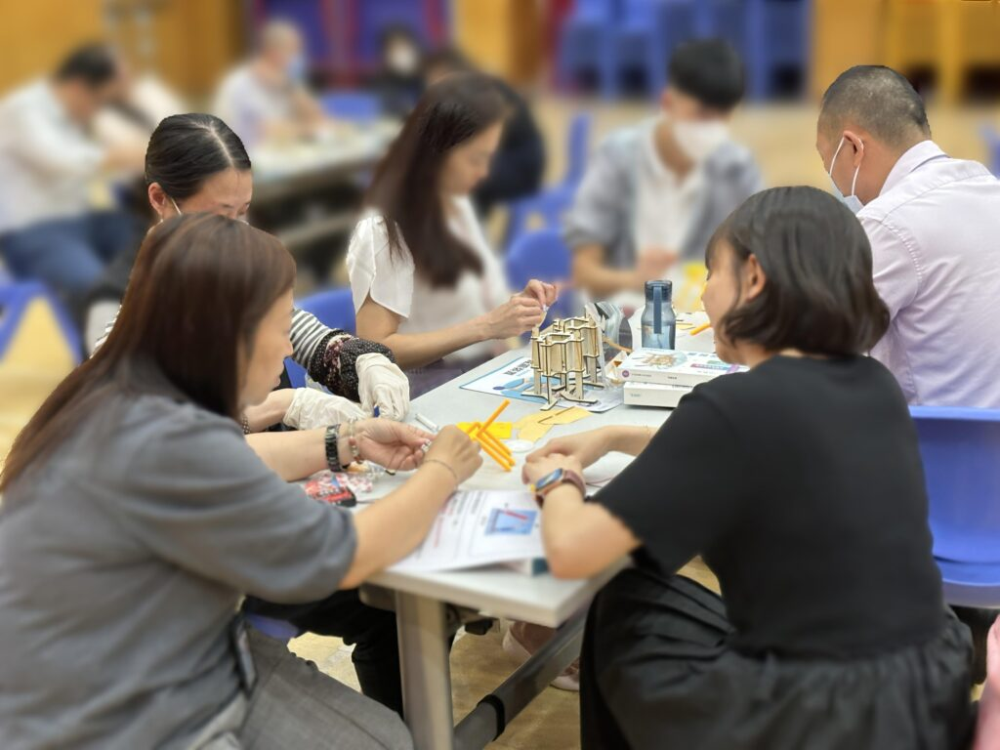
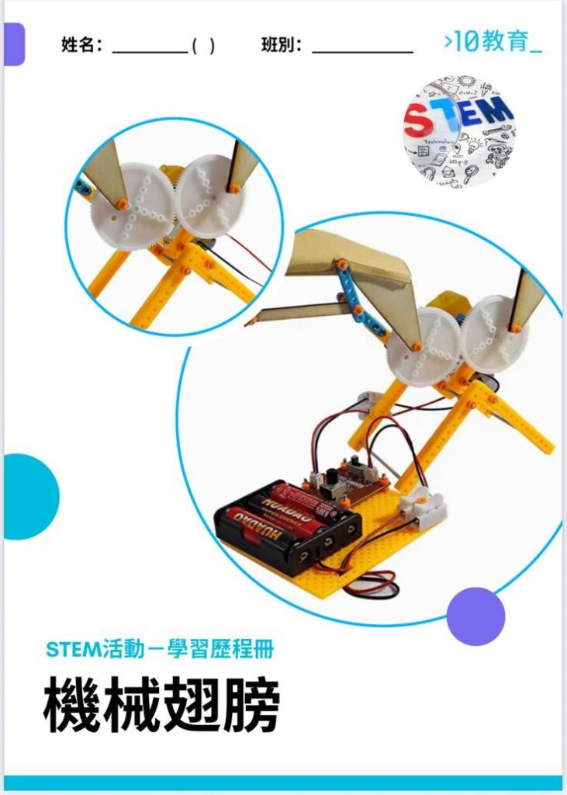

10教育為聖公會將軍澳基德小學主持的「科學手作教師培訓及體驗工作坊」已圓滿落幕。這場以科學手作教學轉化為核心的實戰培訓，為與會教師帶來了兼具知識深度與教學實用性的充實體驗。

## 活動中，兩大核心實作環節讓教師們深度參與、收穫甚豐：

* 減震裝置設計：教師們分組協作搭建吸震結構，導師結合實物講解能量轉換原理，讓抽象物理知識與具體結構設計緊密聯繫。
* 機械翅膀組裝：圍繞翼面設計與動力傳導展開探究，同步解析仿生學在工程設計中的應用，讓自然智慧與人工設計形成生動對照。

在工作坊中，我們為教師們提供了教師 PPT 與學生講義，並創造實踐機會，讓教師親身嘗試運用手作材料。透過這一過程，教師們得以深入思考，如何巧妙地運用這些教學資源，將其融入課堂，設計出更豐富、有趣的教學活動，進而提升學生的學習參與度與效果。

## 教學應用價值顯著

我們始終以扎實的內容設計和實戰導向的培訓模式，為學校與教師提供兼具科學性與可操作性的課程支持。若您也希望為教師團隊引入這類能直接落地、提升課堂質量的教學工具，歡迎關注我們的課程體系 —— 從原理到實踐，從手作到教學，我們堅持以實用為核心，助力教學創新更高效、更深入。

若貴校也想為老師提供相關的服務，[歡迎與我們聯繫](/聯絡我們)！