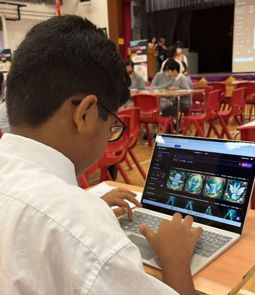

「只用一句話，AI就能畫出你的想像！」

10教育早前到可立中學，為學生們舉辦了一場別開生面的AI藝術創作STEM Day活動。在這次活動中，學生們體驗的不只是 AI 繪圖工具，而是未來最重要的能力：如何與AI對話，讓它理解你的想法，將腦海中的意念變成看得見的成果💡。

## 活動重點

在本次STEM Day活動中，學生們親身體驗了人工智能藝術創作的魅力。通過實際操作，他們學會了：

**AI圖像生成體驗**：學生通過AI技術生成圖像，體驗前沿科技🤖
**提示工程技巧**：如何撰寫精確的AI指令，讓AI理解創作意圖
**創意思維培養**：將想像力轉化為具體的藝術作品

這次體驗，讓學生明白：
🌟 AI 不是取代人類，而是放大我們的創造力
🌟 關鍵不在工具，而在如何設計出好指令（Prompt Engineering）

「原來，只要講得清楚，AI就能畫得出來！」學生們在活動中驚喜地發現，精準的提示能帶來理想的結果，好的指令讓AI成為最懂你的夥伴🎨。活動現場氣氛熱烈，同學們對AI藝術創作表現出極大的興趣和參與度。

## 教育意義

這次AI藝術創作活動不僅是一次技術體驗，更是一次教育理念的實踐。學生們在互動中學習，感受到AI技術與藝術創作的完美結合，培養了對未來科技發展的興趣和認知。活動更鍛煉了他們的創造力和邏輯思維能力！🤝💡

未來，懂得如何與AI溝通的人，將掌握AI的力量。10教育期待與更多學校合作，讓學生體驗「一句話改變世界」的AI魅力，攜手推動 AI 教育，培養新世代的創新領袖✨。
