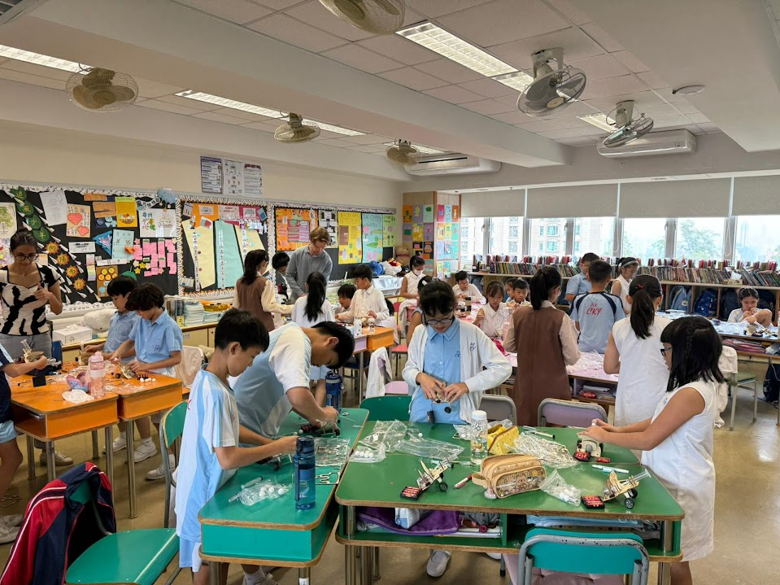

10教育近日在保良局蔡繼有學校成功舉辦了一場精彩紛呈的科學手作工作坊，讓學生們在充滿樂趣的實踐活動中，深入探索科學的奧秘。

## 動手實踐，體驗科學樂趣

工作坊中，學生們積極參與各項科學手作活動，透過親手製作各種科學作品，將抽象的科學理論轉化為具體的學習體驗。課堂上，學生們專注地組裝零件、測試功能，在老師的指導下，逐步理解科學原理背後的奧秘。

## 科學手作的教學價值

科學手作不僅能激發學生的學習興趣，更能培養他們：

* **動手能力**：透過實際操作，提升手眼協調與精細動作技能
* **科學思維**：在製作過程中理解科學原理，培養邏輯思考能力
* **創造力**：鼓勵學生發揮創意，設計屬於自己的作品
* **問題解決能力**：面對製作過程中的挑戰，學習分析與解決問題

## 多元化的科學探索

工作坊涵蓋了多個科學領域，包括：
- 物理原理的應用（如重力、慣性、摩擦力等）
- 機械結構的組裝與運作
- 能量轉換的實際體驗
- 光學原理的探索

學生們在輕鬆愉快的氛圍中學習，不僅掌握了科學知識，更培養了對科學的熱愛與好奇心。

## 探索更多科學手作作品

想了解更多精彩的科學手作作品嗎？歡迎瀏覽我們的[科學手作作品展示](/science/)頁面，探索更多創意與科學結合的精彩作品！

科學手作不僅是學習工具，更是啟發學生科學興趣的重要途徑。10教育致力於提供優質的STEM教育體驗，讓每位學生都能在實踐中發現科學的樂趣。

若貴校也想為學生安排類似的科學手作工作坊，[歡迎與我們聯繫](/contact-us/)！

