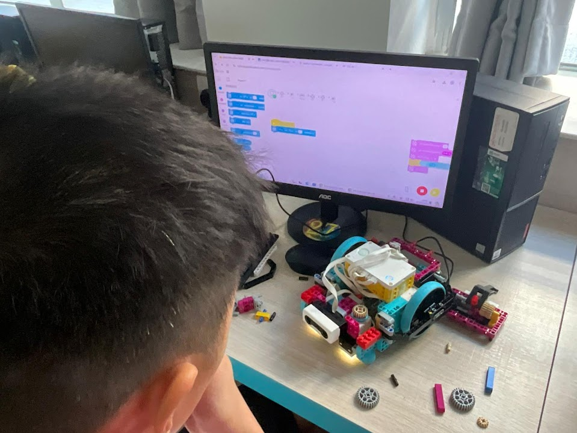

10教育近日在香港培正小學成功舉辦了精彩的 Lego Spike Prime 和 Essential ECA 活動，讓學生們在充滿樂趣的實踐活動中，深入探索機器人技術與編程的奧秘。

## 動手實踐，體驗機器人編程樂趣

活動中，學生們積極參與各項 Lego Spike Prime 機器人編程活動，透過親手組裝機器人、編寫程式，將抽象的編程概念轉化為具體的學習體驗。課堂上，學生們專注地操作電腦、編寫方塊程式，在老師的指導下，逐步理解機器人控制的原理與技巧。

## Lego Spike Prime 的教學價值

[Lego Spike Prime 機器人技術大師班](/school-courses/Lego%20Spike%20Prime%20機器人技術大師班/)不僅能激發學生的學習興趣，更能培養他們：

* **編程思維**：透過視覺化方塊編程，學習邏輯思考與問題解決能力
* **工程設計**：在組裝機器人的過程中，理解機械結構與動力傳導原理
* **創造力**：鼓勵學生發揮創意，設計屬於自己的機器人作品
* **團隊合作**：透過小組協作，培養溝通與協作能力

## 多元化的學習體驗

活動涵蓋了多個學習領域，包括：
- 方塊編程基礎與進階技巧
- 傳感器應用（顏色感應器、距離感應器）
- 機器人機械結構設計
- 自動化控制與路徑規劃

學生們在輕鬆愉快的氛圍中學習，不僅掌握了機器人編程知識，更培養了對 STEM 教育的熱愛與好奇心。透過實際操作 Lego Spike Prime，學生能夠將理論知識與實作經驗相結合，加深對機器人技術的理解。

## 探索更多機器人課程

想了解更多精彩的機器人課程嗎？歡迎瀏覽我們的 [Lego Spike Prime 機器人技術大師班](/school-courses/Lego%20Spike%20Prime%20機器人技術大師班/)課程頁面，探索更多創意與科技結合的精彩內容！

機器人教育不僅是學習工具，更是啟發學生對科技興趣的重要途徑。10教育致力於提供優質的 STEM 教育體驗，讓每位學生都能在實踐中發現學習的樂趣。

若貴校也想為學生安排類似的機器人課程或 ECA 活動，[歡迎與我們聯繫](/聯絡我們/)！

