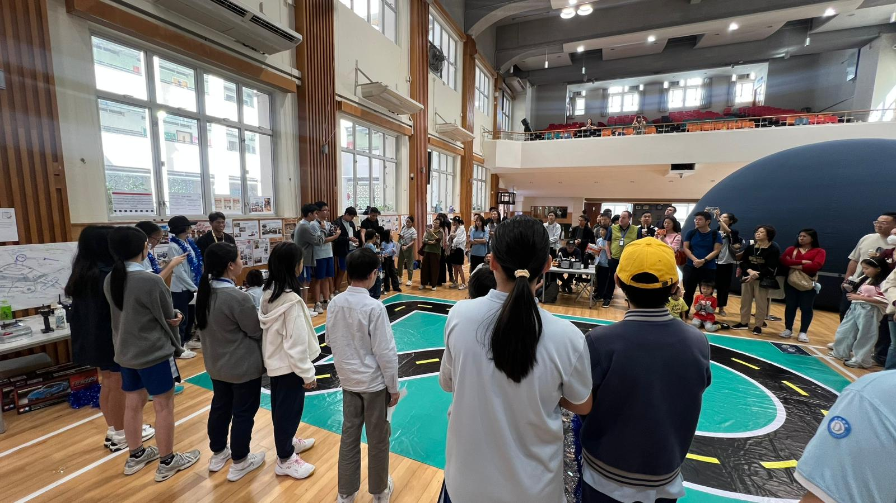
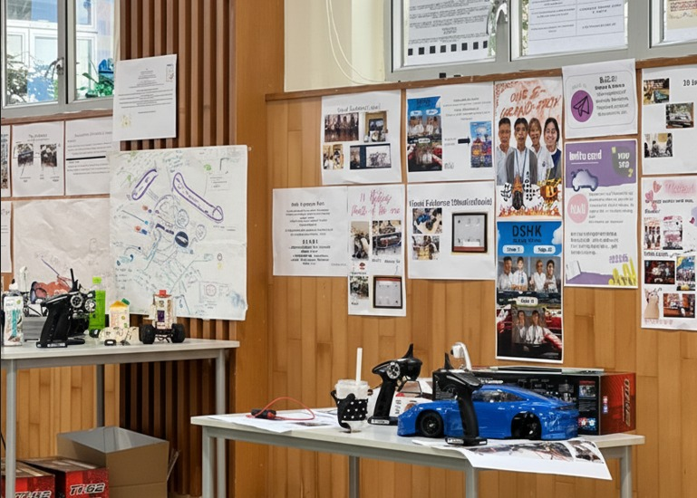
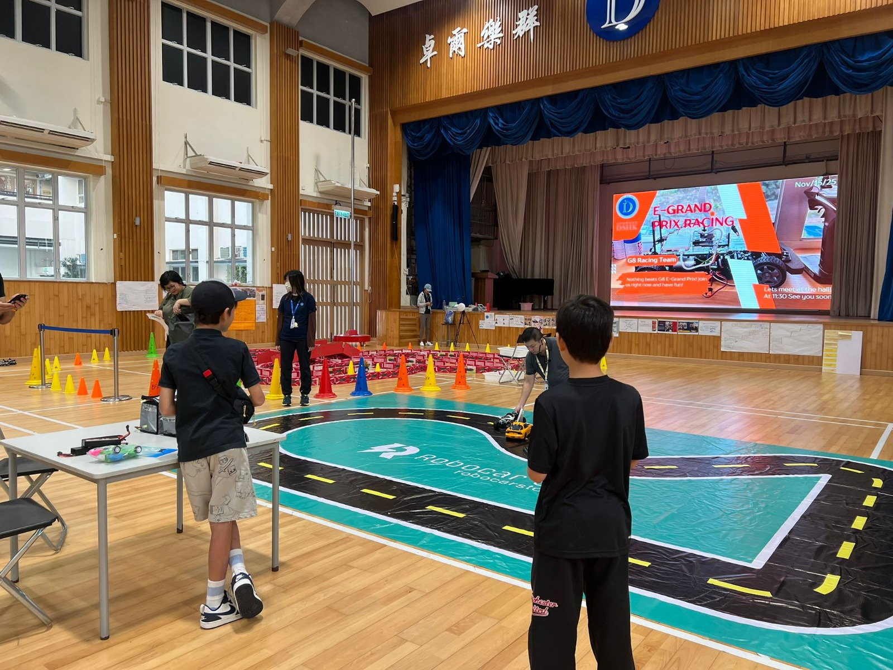
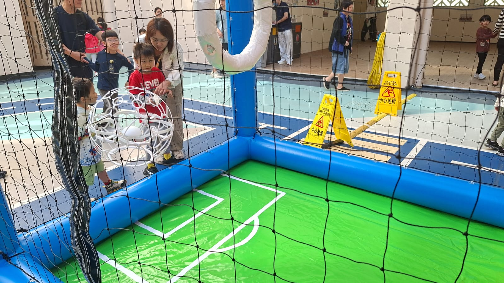
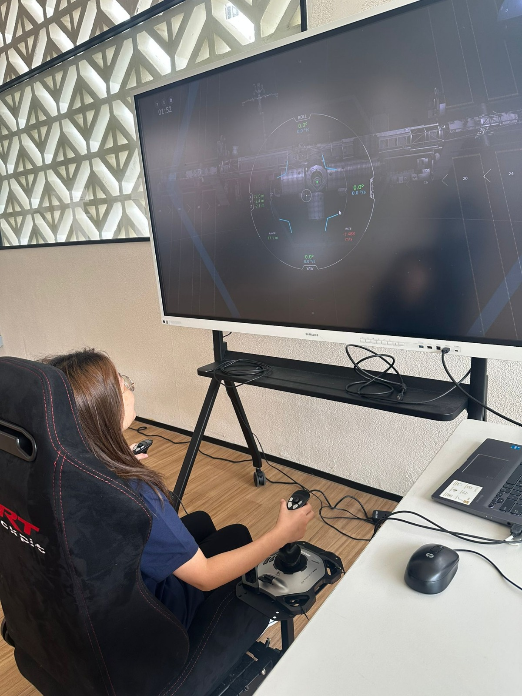

10 教育於 11 月榮幸受邀，協助 道爾頓學校（Dalton School） 成功舉辦第八屆創科嘉年華！

本次活動歷經２個月的緊密籌備，從前期的 Grade 8 Donkey Car Formula AI 課程 教學，到活動當日的成果展示與大型攤位策劃，我們致力為學生帶來最前沿的科技體驗。

## Donkey Car 展示區：展現自主學習成果

在 Donkey Car 展示區，我們欣喜地看到學生們不僅掌握了 AI 駕駛技術，更製作了精美的小海報，藉此向來賓解構 AI 原理與硬件知識，充分體現了自主學習的成果。

## 多元體驗專區，激發創科興趣

此外，10 教育在現場設立了多個深受歡迎的體驗專區，透過互動實踐激發學生的創科興趣：

### 🎨 AI 數碼動畫展

讓學生體驗生成式 AI (Generative AI) 的應用。通過將手繪圖案轉化為動態影像並在 LED Wall 展示，學生在創作中學習機器學習的基本概念，感受科技與藝術的融合。

### 🛸 無人機足球

透過手控無人機進行競技，導師現場指導飛行技巧與過門策略，訓練學生的專注力與空間感。

### 🚀 SpaceX 太空站接駁任務

透過模擬火箭對接流程，讓學生在虛擬環境中接觸航天技術，開闊對太空探索的視野。

### ⚽ Micro:bit 足球車比賽

引入圖像識別與手勢控制等新穎技術，讓學生體驗編程與硬件結合的樂趣。

🔗 **了解更多 STEAM Day 活動及攤位詳情：** [https://bit.ly/4oIiVyp](https://bit.ly/4oIiVyp)

## 感謝與展望

感謝校方的信任以及所有參與者的熱情投入，亦特別鳴謝我們的英語導師團隊提供專業支援。

看到學生們在活動中流露出的好奇與快樂，是我們最大的動力！

