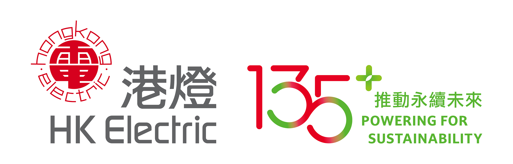

2026年3月1日，10教育在公司總部舉辦了一場別開生面的STEM Day活動，吸引了眾多對科學、科技、工程及數學充滿好奇的學生參與。本次活動旨在透過一系列互動性強、趣味盎然的體驗，激發學生對STEM領域的興趣，並培養他們的創新思維和解難能力。活動現場氣氛熱烈，學生們積極投入，展現出對科技學習的濃厚熱情。

## 探索科技奧秘

本次STEM Day活動內容豐富多元，涵蓋了多個STEM範疇。學生們有機會親身體驗編程的樂趣，透過簡單的指令控制機器人完成任務，從中學習邏輯思維和問題解決的技巧。此外，我們還設置了科學實驗區，讓學生們動手操作，觀察各種科學現象，例如製作火山模型、探索電路原理等，將課本知識轉化為生動的實踐體驗。這些活動不僅加深了學生對科學概念的理解，更培養了他們的動手能力和團隊協作精神。

## 創意工程挑戰

在工程挑戰環節，學生們被分成小組，共同面對一系列創意任務。例如，他們需要利用有限的材料設計並搭建一座能夠承受一定重量的橋樑，或者編程控制無人機完成指定路線的飛行。這些挑戰要求學生們發揮想像力，運用所學的科學和工程知識，共同尋找最佳解決方案。過程中，學生們不僅學習了工程設計的基本原則，也體驗了從構思到實踐的完整過程，深刻體會到團隊合作的重要性。

## 活動成果與展望

本次STEM Day活動取得了圓滿成功，學生們在輕鬆愉快的氛圍中學習了新知識，掌握了新技能。許多學生表示，這次活動讓他們對STEM產生了更濃厚的興趣，甚至萌生了未來投身科技領域的志向。10教育深信，透過舉辦此類活動，能夠為香港的年輕一代播下科技創新的種子，為他們未來的發展奠定堅實基礎。我們將繼續致力於推廣STEM教育，為學生提供更多優質的學習機會。

如果您的學校對相關課程或活動有興趣，歡迎與我們聯繫，共同探索科技教育的無限可能！
