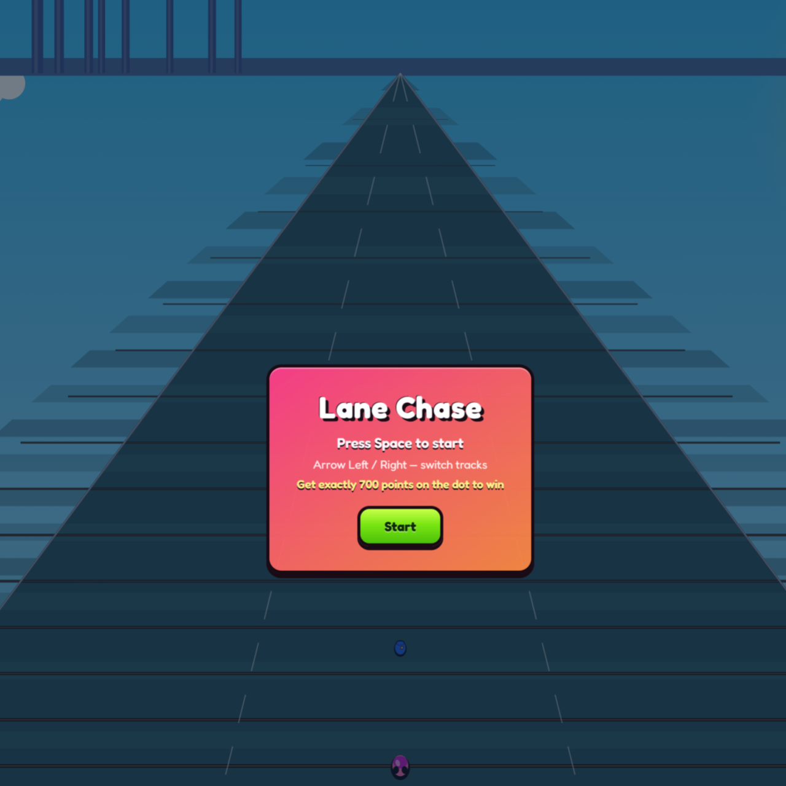

日前，10教育與學友社攜手合作，成功舉辦了一場別開生面的「Vibe Coding遊戲編程」工作坊。是次活動旨在向學生介紹AI時代下的全新編程學習模式，讓即使是零基礎的學員也能在短時間內體驗遊戲開發的樂趣。工作坊吸引了眾多對科技與編程充滿好奇的學生參與，他們在導師的悉心指導下，共同探索了Vibe Coding的奧秘，並親手創造出屬於自己的互動遊戲。

## Vibe Coding：AI 時代的編程新體驗

Vibe Coding是一種創新的編程學習工具，它結合了人工智能技術，讓編程變得更加直觀和易於上手。傳統的編程學習往往需要學生掌握複雜的語法和邏輯，對於初學者而言門檻較高。然而，Vibe Coding透過視覺化介面和智能輔助功能，大大降低了學習難度，讓學生能夠專注於創意發想和問題解決。在本次工作坊中，導師首先向學生介紹了Vibe Coding的基本概念和操作方法，並透過生動的案例激發他們的學習興趣。

## 從零開始：遊戲開發的奇妙旅程

工作坊的核心環節是讓學生親自動手，從零開始建構自己的遊戲。導師們精心設計了一系列循序漸進的教學內容，引導學生逐步完成遊戲的設計、編程和測試。學生們學習了如何設定遊戲場景、設計角色動作、編寫互動邏輯，甚至加入了音效和視覺效果，讓遊戲變得更加豐富有趣。儘管時間有限，但學生們展現出了驚人的學習能力和創造力，許多人都在短短幾個小時內成功開發出具備基本功能的遊戲，並迫不及待地與同伴分享他們的成果。

## 激發創意與邏輯思維

是次「Vibe Coding遊戲編程」工作坊不僅讓學生體驗了編程的樂趣，更重要的是培養了他們的邏輯思維能力、問題解決能力和創新精神。在遊戲開發的過程中，學生需要不斷思考如何實現特定的功能，如何解決遇到的技術難題，以及如何讓遊戲更具吸引力。這些挑戰促使他們積極思考，勇於嘗試，並從錯誤中學習。許多學生表示，這次工作坊讓他們對編程產生了濃厚的興趣，並激發了他們未來繼續探索科技領域的熱情。

10教育衷心感謝學友社的鼎力支持，讓這次富有意義的工作坊得以圓滿成功。我們深信，透過Vibe Coding這類創新工具，能夠讓更多學生接觸並愛上編程，為他們在AI時代的發展奠定堅實的基礎。我們期待未來能與更多學校和機構合作，共同推動香港的STEM教育發展，培養更多具備未來技能的創新人才。

如果您的學校對相關課程或活動有興趣，歡迎與我們聯繫，共同探索科技教育的無限可能！
