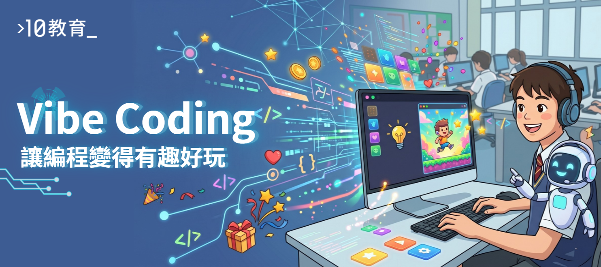

日前，10教育與學友社攜手舉辦了一場別開生面的「Vibe Coding遊戲編程」工作坊。是次活動旨在讓學生體驗將創意轉化為實際遊戲的樂趣，並學習如何利用AI工具輔助編程。在短短數小時內，參與的學生們從零開始，親手建構出屬於自己的遊戲，充分展現了他們驚人的創造力與學習潛力。

## 遊戲總導演：創意與好玩的結合

傳統的編程學習往往側重於語法記憶與程式碼輸入，容易讓學生感到枯燥。然而，在「Vibe Coding遊戲編程」工作坊中，我們將學生定位為「遊戲總導演」，讓他們將專注力回歸到「創意」與「好玩」的核心。學生不再是低頭死記語法的打字員，而是掌握全局、引導AI開發的「導演」。這種全新的學習模式，極大地激發了學生的學習興趣與主動性，讓他們在輕鬆愉快的氛圍中掌握編程技能。

## AI輔助編程：從五子棋到個人迷你遊戲

工作坊內容分為兩個主要環節，循序漸進地引導學生探索AI編程的奧秘：

### 第一節：製作五子棋對決

在這一環節，學生們學習了具體的Prompting技巧，即如何有效地向AI發出指令，引導其生成所需的程式碼。透過實踐，他們一步步地引導AI開發出一個完整的網頁版五子棋遊戲。這個過程不僅讓學生理解了AI在編程中的應用，更培養了他們邏輯思維和問題解決的能力。

### 第二節：創作個人Mini Game

掌握了AI輔助編程的基礎後，學生們進入了更具挑戰性的環節——創作個人迷你遊戲。在這個環節中，他們被賦予了無限的創意空間，從遊戲概念設計到實際開發，全程由學生主導。他們運用所學的Prompting技巧，結合自己的奇思妙想，從零開始開發出專屬的網頁小遊戲。這些獨特的遊戲作品充分展現了每位學生的個性和創意。

## 成果與展望

是次「Vibe Coding遊戲編程」工作坊取得了圓滿成功。學生們不僅掌握了AI輔助編程的基本技能，更重要的是，他們體驗到了將創意付諸實踐的成就感，並對科技創新產生了濃厚的興趣。10教育深信，透過這種以學生為中心、強調實踐與創意的教學模式，能夠有效培養未來所需的創新人才。

如果您的學校對相關課程或活動有興趣，歡迎與我們聯繫，共同探索科技教育的無限可能！
