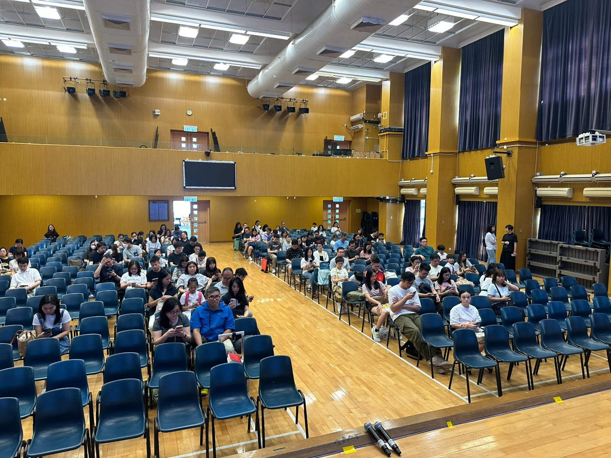

2026年7月4日，10教育的講者Jonathan Tse應邀前往聖公會德田李兆強小學，為該校的家長們舉辦了一場內容豐富的「媒體和資訊素養講座」。是次講座旨在提升家長們對現今複雜網絡環境的認識，並協助他們引導子女安全、負責任地使用數碼媒體，共同建立健康的網絡習慣。

## 講座內容精華

Jonathan Tse先生在講座中深入淺出地講解了多個關鍵議題，包括網絡安全的重要性、如何辨識虛假資訊、保護個人私隱的策略，以及培養批判性思維以應對海量資訊的挑戰。他透過生動的案例分析和實用的建議，讓家長們了解到網絡世界潛藏的風險，並掌握了應對這些風險的有效方法。講座內容不僅涵蓋了理論知識，更注重實用性，讓家長們能夠將所學應用於日常生活中，與子女一同探索數碼世界。

## 提升家長數碼素養

隨著科技的迅速發展，數碼媒體已成為我們生活中不可或缺的一部分，尤其對成長中的學童影響深遠。本次講座特別強調家長在子女數碼成長過程中的引導角色，鼓勵家長們積極參與，共同學習。Jonathan Tse先生分享了許多與子女溝通的技巧，教導家長如何與孩子討論網絡內容，建立開放的對話空間，從而幫助孩子建立正確的價值觀和網絡行為規範。家長們在講座中積極提問，與講者互動交流，現場氣氛熱烈。

## 講座成果與展望

是次講座圓滿成功，獲得了聖公會德田李兆強小學家長們的廣泛好評。許多家長表示，透過講座他們對媒體和資訊素養有了更全面的認識，也學到了許多實用的方法來保護子女免受網絡不良資訊的影響。10教育深信，提升家長和學生的數碼素養，是建構健康數碼社會的基石。我們將繼續致力於推廣相關教育，為學校和社區提供更多有價值的資訊和支援。

如果您的學校對相關課程或活動有興趣，歡迎與我們聯繫，共同探索科技教育的無限可能！
